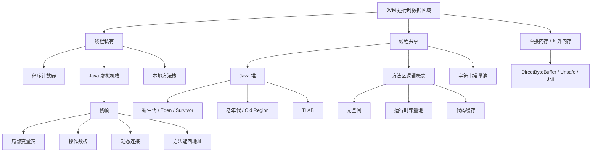

# 运行时数据区域

JVM 运行时数据区域由线程私有区域和线程共享区域组成。线程私有区域随线程创建和销毁，线程共享区域随虚拟机进程生命周期存在。

## 总体结构

图中“方法区”是 JVM 规范中的逻辑概念，HotSpot JDK 8+ 主要用元空间承载类元数据；直接内存不属于 JVM 规范定义的运行时数据区，但生产排查内存时必须一起核算。

## 区域划分

| 区域 | 线程共享 | 主要内容 | 常见异常 |
| --- | --- | --- | --- |
| 程序计数器 | 否 | 当前线程执行的字节码行号指示器 | 规范中唯一没有规定 `OutOfMemoryError` 的区域 |
| Java 虚拟机栈 | 否 | 栈帧、局部变量表、操作数栈、动态连接、方法返回地址 | `StackOverflowError`、`OutOfMemoryError` |
| 本地方法栈 | 否 | Native 方法调用栈 | `StackOverflowError`、`OutOfMemoryError` |
| Java 堆 | 是 | 对象实例、数组、TLAB、GC 分代或 Region | `OutOfMemoryError: Java heap space`、`GC overhead limit exceeded` |
| 方法区 | 是 | 类元数据、字段、方法、运行时常量池、即时编译代码缓存等逻辑数据 | 元空间或代码缓存 OOM |
| 运行时常量池 | 是 | Class 文件常量池加载后的运行时表示 | 常量过多或类加载过多导致元空间压力 |
| 字符串常量池 | 是 | `String.intern()` 管理的字符串引用表 | 表过小会增加查找成本，堆压力过大可能 OOM |
| 直接内存 | 是 | NIO `DirectByteBuffer`、Unsafe、JNI 分配的堆外内存 | `OutOfMemoryError: Direct buffer memory` |

## 程序计数器

- 每个线程独立维护，用于支持线程切换后恢复执行位置。
- 执行 Java 方法时记录正在执行的字节码指令地址；执行 Native 方法时值通常为空。
- 分支、循环、异常处理、线程恢复都依赖程序计数器。

## Java 虚拟机栈

- 每次方法调用创建一个栈帧，方法返回或异常退出时栈帧出栈。
- 局部变量表存放基本类型、对象引用和 `returnAddress`，容量在编译期确定。
- 操作数栈用于字节码指令计算，JVM 指令集以操作数栈为中心。
- 动态连接指向运行时常量池中的方法引用，支持符号引用到直接引用的解析。
- `-Xss` 控制单线程栈大小。栈过小容易递归溢出，栈过大可能降低可创建线程数。

### 栈异常边界

- `StackOverflowError`：线程请求的栈深度超过虚拟机允许深度，常见于递归、循环调用、代理链过深。
- `OutOfMemoryError`：如果 JVM 栈支持动态扩展，扩展时无法申请到足够内存可能抛出 OOM；HotSpot 常见实现中线程创建失败更多表现为 `unable to create native thread`。
- 面试中要区分单线程栈深度问题和进程无法创建更多线程的问题，后者通常与 `-Xss`、线程数、ulimit、容器内存有关。

## 本地方法栈

- 本地方法栈 Native Method Stack 用于支持 Native 方法调用，服务对象是 JVM 使用到的本地方法，典型入口是 JNI。
- Java 虚拟机栈服务于 Java 方法执行，本地方法栈服务于 Native 方法执行；两者都属于线程私有区域，生命周期随线程创建和销毁。
- JVM 规范只规定本地方法栈的抽象职责，没有强制要求具体实现形式。HotSpot 中本地方法栈和 Java 虚拟机栈在实现上通常合并管理，因此 `-Xss` 往往同时影响 Java 调用栈和 Native 调用栈可用空间。
- 执行 Native 方法时，程序计数器值通常为空或未定义，因为此时不再执行 JVM 字节码指令。
- Native 调用可能通过 JNI 访问 Java 对象、创建本地引用、调用 Java 方法、申请堆外内存或调用系统库，因此问题可能表现为栈溢出、native 内存上涨、进程崩溃或 JVM crash。

### 常见 Native 来源

- JDK 自身 Native 方法，例如 `Object.hashCode()`、`System.arraycopy()`、文件 IO、Socket、压缩、加解密和部分 Unsafe 能力。
- JNI/JNA/JNR 调用的 C/C++ 动态库。
- Netty、RocksDB、LevelDB、Lucene mmap、压缩库、图像处理库、机器学习推理库等依赖的 native 组件。
- 操作系统线程、文件描述符、网络连接、mmap、DirectByteBuffer 背后的 native 资源。

### 常见异常与风险

- `StackOverflowError`：Native 调用链过深，或 Java 与 Native 互相递归调用导致线程栈耗尽。
- `OutOfMemoryError`：无法为线程栈或 native 资源申请足够内存，常见表现也可能是 `unable to create native thread`。
- `OutOfMemoryError: Direct buffer memory`：Native 或 NIO 直接内存使用超过限制，虽然不完全等同于本地方法栈，但经常和 native 调用链一起排查。
- JVM crash：Native 库越界访问、非法指针、ABI 不兼容、重复释放内存等可能导致 `SIGSEGV`、`SIGBUS`，通常生成 `hs_err_pid*.log`。

### 排查要点

- 线程创建失败：检查线程数、`-Xss`、容器内存、`ulimit -u`、PID 限制和系统线程限制。
- native 内存上涨：启动时开启 `-XX:NativeMemoryTracking=summary`，用 `jcmd <pid> VM.native_memory summary` 或 `summary.diff` 观察 Thread、Internal、Arena、NIO 等分类。
- JVM crash：分析 `hs_err_pid*.log` 中的问题线程、native frame、动态库、信号类型和 JVM 参数。
- JNI 本地引用泄漏：检查 Native 代码是否及时释放 local/global reference，长时间循环 JNI 调用尤其要关注本地引用表溢出。
- 容器场景：即使 Java 堆稳定，native 栈、直接内存、mmap 和第三方 native 库也可能推高 RSS 触发 OOMKill。

## Java 堆

- 堆是 GC 管理的主要区域，几乎所有对象实例和数组都在堆上分配。
- HotSpot 常见分配路径是优先在 Eden 的 TLAB 中分配，TLAB 不够再走慢路径。
- 新生代对象经过 Minor GC 后仍存活会增加年龄，达到阈值或 Survivor 空间不足时晋升到老年代。
- 大对象可能直接进入老年代，G1 中超过 Region 一半大小的对象会按 Humongous 对象处理。

### 分代与 Region

- 经典分代收集器把堆划分为新生代和老年代，新生代再分 Eden、From Survivor、To Survivor。
- G1 仍有逻辑分代，但物理上以 Region 为单位组织，Region 可动态扮演 Eden、Survivor、Old 或 Humongous。
- ZGC 和 Shenandoah 不以传统分代作为核心设计；JDK 21 的分代 ZGC 重新引入年轻代和老年代以优化短命对象回收。

## 方法区与元空间

- 方法区是 JVM 规范中的逻辑区域，HotSpot 在 JDK 8 之后使用元空间实现主要类元数据存储。
- 元空间使用本地内存，受 `-XX:MetaspaceSize` 和 `-XX:MaxMetaspaceSize` 影响。
- 类加载过多、动态代理/CGLIB 生成类过多、ClassLoader 泄漏会导致元空间持续上涨。
- 运行时常量池属于方法区逻辑内容，保存字面量和符号引用的运行时表示。

### 永久代与元空间

- JDK 7 及以前 HotSpot 使用永久代实现方法区的主要内容，受 `-XX:PermSize` 和 `-XX:MaxPermSize` 影响。
- JDK 8 移除永久代，类元数据主要放到本地内存中的元空间，字符串常量池和静态变量等位置也发生过调整。
- 元空间使用本地内存不代表无限，仍会受 `MaxMetaspaceSize`、进程可用内存和容器 limit 约束。

## 字符串常量池

- JDK 7 起字符串常量池主要位于堆中，底层由 StringTable 管理。
- `String.intern()` 会尝试把字符串引用放入常量池；重复内容可共享引用，但会增加 StringTable 查找压力。
- `-XX:StringTableSize` 可调整 StringTable 桶数量，字符串大量 `intern()` 时需要关注冲突和 GC 成本。

### intern 面试要点

- 字面量字符串在类加载或首次使用相关常量时进入字符串常量池。
- `intern()` 返回常量池中与当前字符串内容相等的引用；如果池中没有，JDK 7+ 通常会把堆中该字符串对象引用加入池中，而不是再复制一份对象内容。
- `new String("a")` 至少会创建堆对象，字面量 `"a"` 是否已存在取决于常量池中是否已有该字面量。

## 直接内存

- 直接内存不属于 Java 堆，但仍受进程内存和 `-XX:MaxDirectMemorySize` 限制。
- NIO、Netty、JNI、Unsafe 都可能使用直接内存。
- 堆内对象只保存堆外内存引用，泄漏时堆占用可能不高，但 RSS 持续增长。

## 代码缓存

- 代码缓存 Code Cache 存放 JIT 编译后的本地机器码、方法适配器和相关运行时代码。
- `-XX:ReservedCodeCacheSize` 控制代码缓存上限，代码缓存满可能导致 JIT 编译受限，热点代码退回解释执行或无法继续优化。
- 可用 `jcmd <pid> Compiler.codecache` 和 JFR Code Cache 事件观察使用情况。

## 容器内存视角

- 容器限制约束的是进程整体内存，不是只约束 Java 堆。
- 进程 RSS 还包括元空间、直接内存、线程栈、代码缓存、GC native 结构、JNI/native 库和 mmap。
- 容器 OOMKill 可能没有 Java 异常栈，需要结合容器事件、RSS 曲线和 JVM 内存指标判断。

## 常见定位

- 堆 OOM：导出 hprof，用 MAT、VisualVM 或 OQL 查看 Dominator Tree、Retained Size 和 GC Roots。
- 元空间 OOM：统计类数量和 ClassLoader 数量，排查动态生成类和 ClassLoader 泄漏。
- 栈溢出：检查递归深度、循环调用、代理链和 `-Xss` 配置。
- 直接内存 OOM：检查 NIO buffer 释放、Netty allocator 指标、`MaxDirectMemorySize` 和容器内存限制。
- 容器 OOMKill：核算堆、非堆、线程栈、直接内存和 native 内存总和是否超过 cgroup limit。
